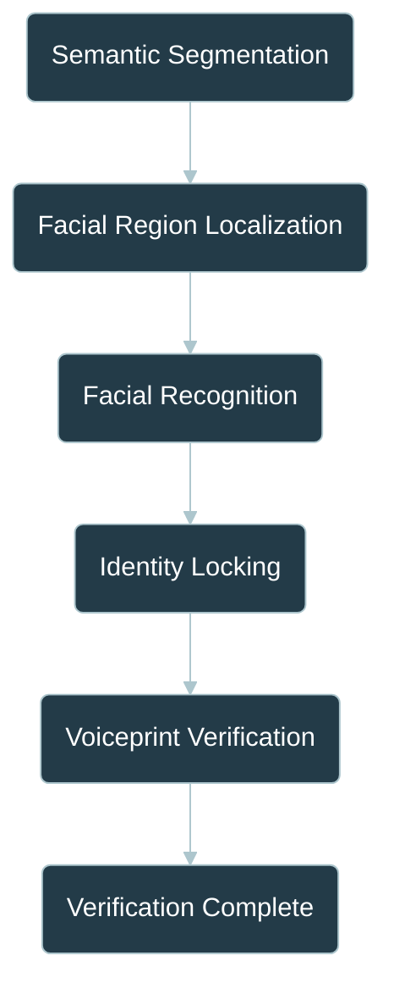
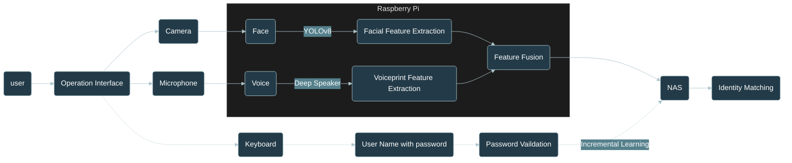
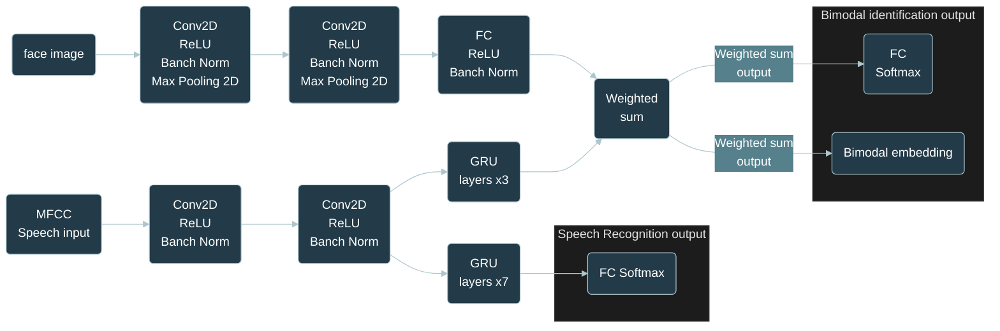

# Transformer_Seg

# 資料收集規範 Data Collection

```text
Data:.
├─Face
├─Voice
├─Original
└─Image
    ├─S1252001
    ├─S1252002
    ├─S1252003
    ├─S1252004
    └─S1252005
		...
```
# 系統架構 Architecture






# 整合 Combination


